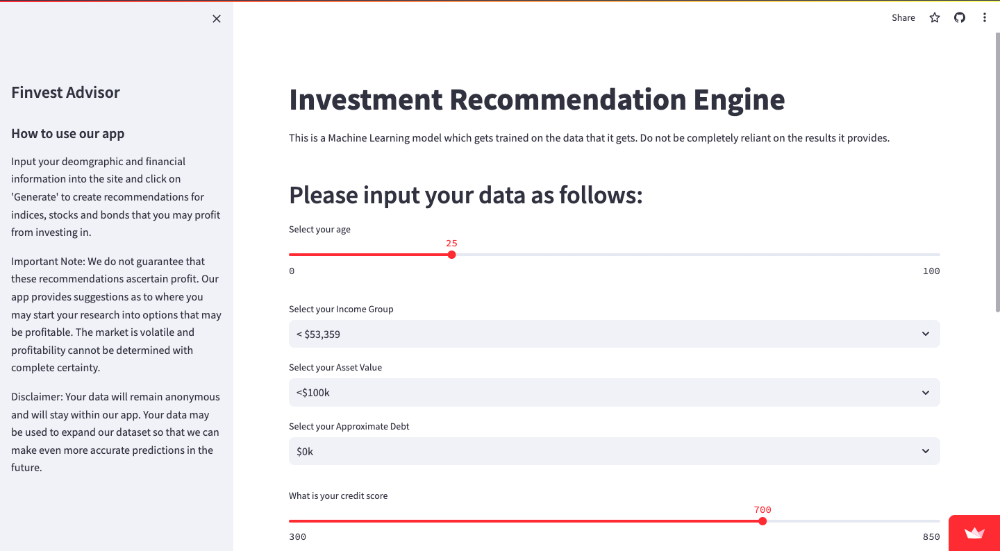

# Finvest Advisor (HTV8)

## Overview

The HTV8 project leverages the principles of cosine similarity search and the basics of machine learning to create an algorithm that provides investment recommendations for mutual funds and bonds to users. While recommendation systems can be incredibly complex, utilizing deep learning techniques [1,2], they can also be simple and effective when based on the similarity between items. In this project, we employ cosine similarity to calculate the similarity between investment options.

Project deployed at: https://finvestadvisor.streamlit.app/

## Introduction

Advancements in the field of machine learning have paved the way for more accurate and personalized investment recommendations. The HTV8 project aims to harness these advances to deliver investment suggestions that align with individual user preferences and financial goals.

## How It Works
The core algorithm of HTV8 relies on cosine similarity to determine the investment options that are most relevant to each user. This approach allows the system to deliver highly personalized recommendations tailored to the unique needs and preferences of each individual. Here's a more detailed explanation of how this algorithm works:

1. **Cosine Similarity:** The algorithm employs cosine similarity, a mathematical measure used to assess the similarity between two vectors. In this context, the vectors represent individuals and investment opportunities. By measuring the cosine of the angle between these vectors, the algorithm can determine how closely the user's profile aligns with each investment opportunity.

2. **User Preferences and Financial Situation:** The algorithm takes into account various aspects of the user's profile, including their risk tolerance, current financial resources, and investment goals. These factors are crucial in understanding the user's financial landscape and objectives.

3. **Vectorization of User Data:** The algorithm accesses a dataset containing information about different individuals. This dataset includes key attributes such as age, income, current asset holdings, risk tolerance levels, and financial goals. These attributes serve as the basis for creating vector representations of each individual within the dataset.

4. **Comparing User Profiles and Investment Options:** To make personalized recommendations, the algorithm compares the vector representing the user's profile with vectors that represent various investment opportunities. By applying cosine similarity, it calculates how similar or dissimilar the user's profile is to each investment option.

5. **Tailored Investment Recommendations:** Based on the results of these comparisons, the algorithm generates tailored investment recommendations for the user. It identifies the investment opportunities that align most closely with the user's financial situation and goals. This ensures that the recommendations are not only relevant but also suitable for the individual's unique circumstances.

## Inclusion of Mutual Fund Data
In addition to the user data, the dataset used by HTV8 also contains information about various mutual funds. This information typically includes details about the fund's historical performance, investment objectives, asset allocation, fees, and other relevant attributes. Each mutual fund in the dataset is represented as a vector that captures its key characteristics.

## User-Database Similarity Calculation
The algorithm's primary objective is to determine how well a user's financial profile aligns with the characteristics of the mutual funds in the database. To achieve this, it computes the similarity between the user's vector (representing their financial profile) and the vectors representing each mutual fund in the dataset. Cosine similarity is commonly used for this purpose.

## Comparing User Preferences to Mutual Funds
The cosine similarity measure calculates the cosine of the angle between the user's vector and each mutual fund's vector. A high cosine value indicates a strong similarity, while a low cosine value implies dissimilarity. The algorithm performs this calculation for all mutual funds in the database.

## Recommendation Generation
Based on the similarity scores, the algorithm ranks the mutual funds in the database in descending order of similarity to the user's financial profile. The funds that have the highest cosine similarity values are considered the most compatible with the user's preferences and financial situation.

## Personalized Mutual Fund Recommendations
The algorithm then recommends the top-performing mutual funds that are most closely aligned with the user's investment goals, risk tolerance, and financial resources. These recommendations are highly personalized and take into account the user's specific financial needs and objectives.

## Consideration of User Constraints
Depending on the user's financial constraints and preferences, the algorithm can also factor in limitations such as the user's budget or specific investment restrictions. This ensures that the recommendations provided are not only compatible with the user but also adhere to their financial constraints.

In summary, HTV8's algorithm goes beyond user profiling to include a comprehensive database of mutual funds. By calculating the similarity between the user's financial profile and the attributes of each mutual fund, the algorithm identifies the most suitable investment options. This personalized approach enables users to receive recommendations that are well-aligned with their unique financial circumstances and objectives, enhancing their investment decision-making process.

Feel free to explore our project to discover how it can assist you in making informed investment decisions.

